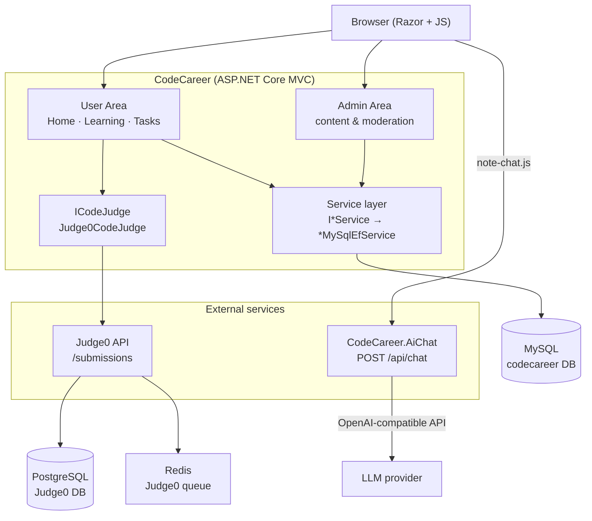

# CodeCareer


A full-stack learning and community platform for software engineers. CodeCareer combines a social feed, structured curriculum (notes and courses), automated code judging via Judge0, and an AI study assistant grounded in note content — all backed by a normalized MySQL schema and an ASP.NET Core MVC application.

The main app is a server-rendered monolith with clear module boundaries (social, learning, judge, admin). LLM credentials and sandboxed code execution are isolated from the web process.

<div>
    
</div>


---

## Key features

| Module | What it does |
|--------|--------------|
| **Social** | Publications with tags, comments, follow/unfollow, user search, rating, profile editing, avatar upload |
| **Learning** | Sections → topics → Markdown notes and coding tasks; courses; note-read and task-solved progress |
| **Judge** | Submit code from the browser → Judge0 sandbox → persisted submissions; progress updates only on `Accepted` |
| **AI assistant** | Context-aware chat on note pages via `CodeCareer.AiChat`; chat history stored per user/note |
| **Profiles** | Skill tags, achievements (extensible keys), in-app notifications |
| **Admin** | Role-based content management (topics, notes, tasks, courses, tags) and moderation |

---

## Tech stack

| Layer | Technology | Role |
|-------|------------|------|
| **Backend** | .NET 8, ASP.NET Core MVC | Server-rendered UI, cookie auth, rate limiting, health checks |
| **AI service** | .NET 8 Minimal API (`CodeCareer.AiChat`) | OpenAI-compatible LLM calls; internal API key gate |
| **Database** | MySQL 8, EF Core 8, Pomelo provider | Single `ApplicationDbContext`; migrations as schema source of truth |
| **Code execution** | Judge0 1.13 | User code runs outside the MVC process |
| **Frontend** | Razor views, Tailwind CSS 3 | Built CSS in Docker/CI; CDN fallback in Development when `tailwind.css` is missing |
| **Markdown** | Markdig + HtmlSanitizer | Note rendering with XSS mitigation |
| **Testing** | xUnit, WebApplicationFactory, Moq | 31 tests (unit + integration smoke) |
| **Infrastructure** | Docker Compose, GitHub Actions | Local full stack; CI build/test/publish |

---

## Architecture



### Request flow highlights

**Authentication** — Cookie-based auth with 7-day sliding expiration. `AuthService` handles sign-in/register, legacy plaintext password upgrade on login, and in-memory login lockout after repeated failures. Admin access uses `Role = Admin` and the `AdminOnly` authorization policy (no separate admin password).

**Code submission** — `LearningController.SubmitSolution` → `Judge0CodeJudge.ExecuteAsync` runs public and hidden test cases (cases with index ≥ 2 are hidden from the response). Result is saved to `submissions`; `ProgressService.MarkTaskSolved` runs only when status is `Accepted`.

**AI chat** — `note-chat.js` calls `CodeCareer.AiChat` directly from the browser. The MVC app persists messages via `SaveChatMessage`. When `InternalApiKey` is configured on AiChat, requests must include `X-Internal-Api-Key` (see [Trade-offs](#trade-offs--design-considerations)).

**Startup** — On boot (except in `Testing` environment): EF migrations apply automatically, `LegacyDataMigrator` normalizes legacy denormalized columns, and `DevelopmentDataSeeder` seeds curriculum data in Development only.

---

## Project structure

```text
CodeCareer/
├── Areas/
│   ├── User/                    # Public & authenticated user features
│   │   ├── Controllers/         # Home, Learning, TasksSolving, OlympTasksSolving
│   │   ├── Services/
│   │   │   ├── Interfaces/      # I*Service contracts
│   │   │   └── Implementations/MySqlEfServices/
│   │   ├── Models/              # EF entities
│   │   ├── Data/
│   │   │   ├── ApplicationDbContext.cs
│   │   │   ├── Migrations/
│   │   │   ├── LegacyDataMigrator.cs
│   │   │   └── LearningDatabaseInitializer.cs
│   │   └── Views/
│   └── Admin/                   # Admin-only content management
├── Judge/                       # ICodeJudge, Judge0CodeJudge
├── Security/                    # AuthService, PasswordService, LoginLockoutService
├── Infrastructure/              # MarkdownSanitizer, LocalFileStorage, exception handler
├── Middleware/                  # RequestId, logging, security headers
├── Configuration/                 # AiOptions, JudgeOptions
└── wwwroot/                     # Tailwind input/output, note-chat.js

CodeCareer.AiChat/               # Standalone Minimal API for LLM chat
CodeCareer.Tests/                # Unit + integration tests
Database/Schema.sql              # Legacy reference schema (EF migrations are authoritative)
```

Interesting entry points for code reading:

- `Program.cs` — DI registration, auth, rate limiting, pipeline
- `Judge/Judge0CodeJudge.cs` — Judge0 integration and test-case loop
- `Areas/User/Controllers/LearningController.cs` — curriculum, judge, AI persistence
- `Areas/User/Data/ApplicationDbContext.cs` — full relational model
- `CodeCareer.AiChat/Program.cs` — LLM proxy and chat contract

---

## Getting started

### Requirements

- [.NET 8 SDK](https://dotnet.microsoft.com/download)
- [Docker](https://www.docker.com/) (recommended for full stack)
- Node.js 20 (only if building Tailwind CSS locally)
- MySQL 8 (required when running without Docker)

### Quick start with Docker

```bash
git clone https://github.com/semaruman/CodeCareer.git
cd CodeCareer
cp .env.example .env   # fill in secrets
docker compose up --build
```

| Service | URL |
|---------|-----|
| Web app | http://localhost:8080 |
| AiChat | http://localhost:7300 |
| Judge0 | http://localhost:2358 |
| MySQL | localhost:3306 |

The web container waits for MySQL health, then applies EF migrations on startup.

### Local development without Docker

**1. MySQL**

Create a database and set the connection string:

```bash
dotnet user-secrets set "ConnectionStrings:DefaultConnection" \
  "Server=localhost;Port=3306;Database=codecareer;User=root;Password=YOUR_PASSWORD;" \
  --project CodeCareer
```

**2. Database migrations**

```bash
dotnet ef database update --project CodeCareer
```

Migrations live in `CodeCareer/Areas/User/Data/Migrations/`. Initial migration: `20260827043004_InitialProductionSchema`.

**3. Tailwind CSS (optional)**

```bash
cd CodeCareer
npm ci
npm run build:css
```

Without a built `wwwroot/css/tailwind.css`, Development falls back to the Tailwind CDN.

**4. Run services**

```bash
# Terminal 1 — main app (http://localhost:5126)
dotnet run --project CodeCareer

# Terminal 2 — AI service (http://localhost:7300)
dotnet run --project CodeCareer.AiChat

# Terminal 3 — Judge0 (or use docker compose up judge0 judge0-db judge0-redis)
```

**5. Admin access**

Register a normal account, then promote it in MySQL:

```sql
UPDATE users SET role = 'Admin' WHERE email = 'your@email.com';
```

Sign in again and open `/Admin/Index`.

### Environment variables

Copy `.env.example` for Docker Compose. For `dotnet run`, use user-secrets or environment variables.

| Variable | Used by | Description |
|----------|---------|-------------|
| `MYSQL_ROOT_PASSWORD` | Docker | MySQL root password |
| `MYSQL_USER` / `MYSQL_PASSWORD` | Docker | Application DB credentials |
| `JUDGE0_DB_PASSWORD` | Docker | Judge0 PostgreSQL password |
| `AICHAT_INTERNAL_API_KEY` | Docker (web + aichat) | Shared secret for AiChat |
| `LLM_API_KEY` | AiChat | OpenAI-compatible API key |
| `LLM_MODEL` | AiChat | Model name (default: `gpt-4o-mini`) |
| `ConnectionStrings__DefaultConnection` | Web | MySQL connection string |
| `AiChat__BaseUrl` | Web | AiChat service URL |
| `AiChat__InternalApiKey` | Web | Configured for server-side HttpClient |
| `Judge__BaseUrl` | Web | Judge0 API URL |
| `Judge__AuthToken` | Web | Optional Judge0 auth token |
| `Llm__ApiKey` / `Llm__Model` | AiChat | LLM provider settings |

Without `Llm__ApiKey`, AiChat responds in demo mode so the UI can be tested without an LLM account.

---

## Development

Commands taken from project configuration:

```bash
# Restore & build solution (3 projects)
dotnet restore CodeCareer.sln
dotnet build CodeCareer.sln -c Release

# Run tests (CI uses MySQL service on port 3306)
dotnet test CodeCareer.sln -c Release

# Build frontend assets
cd CodeCareer && npm ci && npm run build:css

# Publish web app
dotnet publish CodeCareer/CodeCareer.csproj -c Release -o ./publish

# EF Core
dotnet ef migrations add <Name> --project CodeCareer
dotnet ef database update --project CodeCareer
```

Local URLs (from `launchSettings.json`):

| App | HTTP | HTTPS |
|-----|------|-------|
| CodeCareer | http://localhost:5126 | https://localhost:7266 |
| CodeCareer.AiChat | http://localhost:7300 | https://localhost:7301 |

---

## Testing

**Framework:** xUnit with `Microsoft.AspNetCore.Mvc.Testing`.

| Suite | Location | Coverage |
|-------|----------|----------|
| Security | `CodeCareer.Tests/Security/` | Password hashing, legacy plaintext upgrade, login lockout |
| Domain | `CodeCareer.Tests/Domain/` | Model invariants, validation attributes, roles |
| Judge | `CodeCareer.Tests/Judge/` | Judge0 status mapping, submission model defaults |
| Integration | `CodeCareer.Tests/Integration/` | `/health`, home page, learning route smoke |

```bash
dotnet test CodeCareer.sln
```

**31 tests** total. CI runs against a MySQL 8 service container. Integration tests use `environment = Testing` to skip startup migrations; the learning page may return 500 without a live database — the test asserts routing exists (not 404).

---

## API

The main application is MVC — it does not expose a public REST API. User interactions are form posts and Razor-rendered pages with CSRF protection (`AutoValidateAntiforgeryToken`).

`CodeCareer.AiChat` exposes a minimal HTTP API:

| Endpoint | Auth | Description |
|----------|------|-------------|
| `GET /health` | None | Liveness check |
| `POST /api/chat` | `X-Internal-Api-Key` when configured | Note-grounded chat |

**Request body** (`POST /api/chat`):

```json
{
  "noteId": 1,
  "noteTitle": "Linear search",
  "noteContext": "…markdown excerpt…",
  "messages": [
    { "role": "user", "content": "Explain time complexity" }
  ]
}
```

**Response:**

```json
{ "reply": "…" }
```

Rate limits: `login` (10/min per IP), `ai-chat` and `submit-code` (20–30/min per user), `write-content` (30/min).

---

## Engineering decisions

**EF Core as single schema source** — All entities map through `ApplicationDbContext` with explicit Fluent API configuration (snake_case columns, indexes, cascade rules). Legacy ADO.NET and JSON-file services were removed. `Database/Schema.sql` reflects an older denormalized schema; use migrations for current structure.

**Service interface + EF implementation** — Controllers depend on `IUserService`, `ITaskService`, etc. Implementations live in `MySqlEfServices/`, keeping data access behind a stable boundary without a full repository abstraction layer.

**Judge isolation via `ICodeJudge`** — User-submitted code never executes in the MVC process. `Judge0CodeJudge` handles async submission creation, polling, and status mapping. Hidden test cases (index ≥ 2) are not exposed in UI feedback.

**AI service separation** — LLM API keys exist only in `CodeCareer.AiChat`. The MVC app configures an `HttpClient` named `"AiChat"` but the note UI calls AiChat directly from the browser for lower latency.

**Legacy migration path** — `LegacyDataMigrator` copies denormalized columns (`password`, `subscriptions_emails`, `tag_names`, etc.) into normalized tables on startup, allowing upgrades from older deployments without a manual data script.

**Security defaults** — `PasswordHasher<UserModel>` (ASP.NET Identity hasher) with transparent upgrade from legacy plaintext. Security headers middleware, HSTS in non-Development, structured request logging with `RequestIdMiddleware`, and `/health` with EF database check.

**Progress integrity** — Task completion and achievements are triggered only after a judge returns `Accepted`, not on manual checkbox actions.

---

## Trade-offs / Design considerations

| Decision | Rationale | Cost |
|----------|-----------|------|
| Server-rendered MVC over SPA | Faster iteration for forms, auth, and admin CRUD; CSRF built-in | Less API reusability for third-party clients |
| Browser → AiChat direct calls | Simpler chat UX without an MVC proxy | When `InternalApiKey` is set, `note-chat.js` does not send the header — AI chat in Docker may require proxying or leaving the key empty for local use |
| Judge0 in Docker (`privileged: true`) | Mature sandbox with multi-language support | Heavy dependency; slow first startup; requires privileged container |
| Auto-migrate on startup | Zero manual migration step in Docker/local dev | Not ideal for all production deployment models |
| `IFrontendChallengeValidator` interface only | HTML/CSS/JS tasks use CodePen embed | No automated frontend task grading yet |
| Tailwind CDN fallback in Dev | No Node.js required for backend-only work | Dev/prod CSS parity requires running `npm run build:css` |

See `PRODUCTION_READINESS.md` for a detailed checklist and known limitations.

---

## Security

Mechanisms present in code (not a security audit):

- Password hashing via `PasswordHasher<UserModel>`; legacy plaintext migration on successful login
- Cookie authentication with `HttpOnly`, `SameSite=Lax`, sliding 7-day expiration
- Role-based authorization (`User`, `Admin`) with `[Authorize]` / `[AllowAnonymous]`
- Global CSRF validation on MVC actions
- ASP.NET Core rate limiting on login, AI, code submit, and write endpoints
- `HtmlSanitizer` on rendered Markdown notes
- Security headers: `X-Content-Type-Options`, `Referrer-Policy`, `Permissions-Policy`, `X-Frame-Options`
- AiChat: optional `X-Internal-Api-Key`, prompt/context length caps, rate limiting
- Secrets via environment variables / user-secrets (no committed credentials)
- Avatar upload through `IFileStorage` / `LocalFileStorage`

---

## Deployment

**Docker Compose** (`docker-compose.yml`) runs five application-relevant services:

| Service | Image / build | Port |
|---------|---------------|------|
| `web` | Multi-stage `Dockerfile` (non-root `appuser`, healthcheck on `/health`) | 8080 |
| `aichat` | `CodeCareer.AiChat/Dockerfile` | 7300 → 8080 |
| `db` | `mysql:8.0` | 3306 |
| `judge0` | `judge0/judge0:1.13.0` | 2358 |
| `judge0-db` + `judge0-redis` | PostgreSQL + Redis for Judge0 | internal |

**CI** (`.github/workflows/ci.yml`): on push/PR to `main`, `master`, `develop` — restore, Tailwind build, `dotnet build`, `dotnet test` with MySQL service, `dotnet publish`.

---

## Contributing

1. Fork the repository and create a feature branch.
2. Run `dotnet test CodeCareer.sln` and ensure CI passes.
3. For UI changes, run `npm run build:css` in `CodeCareer/`.
4. Open a pull request against `main` or `develop` with a concise description of the change and how you tested it.

---

## License

No license file is present in the repository. Contact the repository owner for usage terms.
