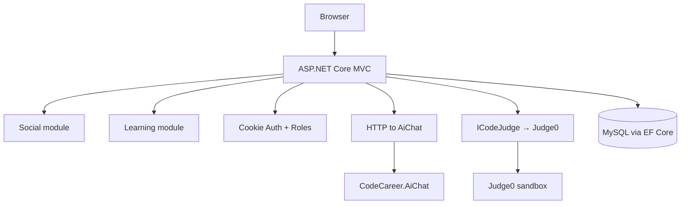

# CodeCareer


Единая платформа для профессионального роста программистов: социальная лента, обучение, автопроверка задач (Judge0), AI-ассистент по конспектам.

## Features

- **Social** — публикации, комментарии, подписки, рейтинг, поиск
- **Learning** — темы, конспекты (Markdown + sanitization), курсы, прогресс
- **Coding challenges** — отправка кода → Judge0 → submissions history → auto progress
- **AI** — отдельный сервис `CodeCareer.AiChat` с internal API key и rate limit
- **Profiles** — аватар, навыки, достижения, уведомления
- **Admin** — role `Admin` через cookie auth (без hardcoded пароля)

## Architecture



## Tech Stack

- .NET 8, ASP.NET Core MVC, Razor
- EF Core 8 + Pomelo MySQL (единая схема + migrations)
- Judge0 для sandbox execution
- Tailwind CSS (build pipeline в Docker/CI)
- xUnit + WebApplicationFactory

## Local development

```bash
git clone https://github.com/semaruman/CodeCareer.git
cd CodeCareer
cp .env.example .env   # заполните секреты

docker compose up --build
```

Приложение: http://localhost:8080  
AiChat: http://localhost:7300  
Judge0: http://localhost:2358

### Без Docker

```bash
cd CodeCareer
dotnet user-secrets set "ConnectionStrings:DefaultConnection" "Server=localhost;..."
dotnet ef database update --project CodeCareer
dotnet run --project CodeCareer
```

### Admin access

Зарегистрируйте обычный аккаунт, затем назначьте роль в MySQL:

```sql
UPDATE users SET role = 'Admin' WHERE email = 'your@email.com';
```

После повторного входа откройте `/Admin/Index`.

## Environment variables

| Variable | Description |
|----------|-------------|
| `ConnectionStrings__DefaultConnection` | MySQL connection |
| `AiChat__BaseUrl` | URL AiChat service |
| `AiChat__InternalApiKey` | Shared secret MVC ↔ AiChat |
| `Judge__BaseUrl` | Judge0 API URL |
| `Llm__ApiKey` | OpenAI-compatible key (AiChat only) |

## Database

```bash
dotnet ef database update --project CodeCareer/CodeCareer
```

Миграции: `CodeCareer/Areas/User/Data/Migrations/`  
Legacy denormalized data migrated on startup via `LegacyDataMigrator`.

## Tests

```bash
dotnet test CodeCareer.sln
```

31 tests (28 unit + 3 integration smoke).

## Security

- Password hashing (`PasswordHasher`, legacy plaintext upgrade on login)
- Cookie auth + `[Authorize]` + Admin role policy
- CSRF (`AutoValidateAntiforgeryToken`)
- Rate limiting (login, AI, submissions, writes)
- HTML sanitization for Markdown notes
- Secrets via env / user-secrets only

## Architecture decisions

- **EF Core** — единый источник схемы; ADO.NET и JSON legacy удалены
- **Judge0** — пользовательский код не выполняется в процессе MVC
- **AiChat** — изолированный сервис, LLM keys только там
- **Docker** — app + mysql + aichat + judge0 для полного local stack
